# 1 Rendering 방정식

렌더링은 빛이 3D 가상환경과 상호작용한 뒤 카메라로 들어오는 과정을 계산하여 2D 이미지를 생성하는 과정입니다.

## 1.1 렌더링 기법

렌더링 기법은 크게 비물리 기반 렌더링과 물리 기반 렌더링으로 나눌 수 있습니다.

- **비물리 기반 렌더링 (Non-physically based rendering)**: 물리적 정확성보다 연산 속도와 구현의 단순성에 초점을 맞춘 방법입니다. 주로 실시간 그래픽스에서 사용됩니다.
- **물리 기반 렌더링 (Physically Based Rendering, PBR)**: 빛의 반사, 굴절, 산란과 같은 물리 법칙을 따른 연산을 통해 현실적인 장면을 얻는 방법입니다.

물리 기반 렌더링의 기초는 렌더링 방정식(Rendering Equation)입니다.

## 1.2 렌더링 방정식

렌더링 방정식[^1]은 다음과 같이 표현됩니다.

$$
I(x, x') = g(x, x')\left[\epsilon(x, x') + \int_S \rho(x, x', x'')\,I(x', x'')\,dx''\right]
$$

각 항의 의미는 다음과 같습니다.

- $I(x, x')$: 점 $x'$에서 점 $x$로 향하는 복사 강도(Radiant Intensity)입니다.
- $g(x, x')$: geometry term입니다. 가림(Occlusion) 여부와 거리 감쇠를 포함하는 항입니다.
- $\epsilon(x, x')$: emittance term입니다. 표면이 직접 빛을 방출하는 경우의 기여를 의미합니다.
- $\rho(x, x', x'')$: scattering term입니다. $x''$에서 $x'$로 입사한 빛이 $x$ 방향으로 반사될 확률 분포이며, BSDF와 관련됩니다.
- $S$: 장면 내 모든 표면의 집합입니다.

이 방정식을 간단히 말하면, 점 $x'$에서 $x$로 가는 빛의 양은 점 $x'$ 자체에서 방출되는 빛의 양과, 점 $x''$에서 점 $x'$로 입사한 빛 중 점 $x$ 방향으로 반사되는 빛의 양을 합한 값입니다.

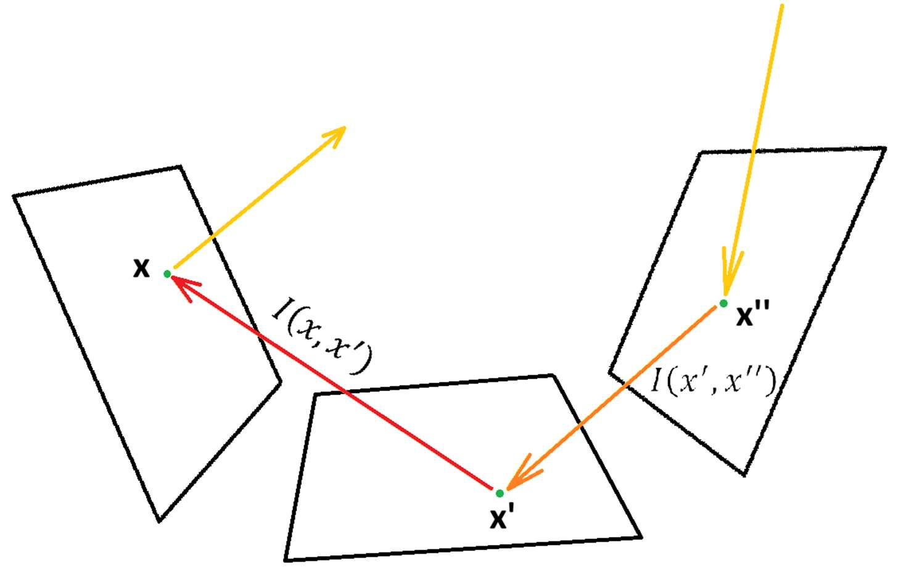

렌더링 방정식에는 scene 내 모든 표면의 집합 $S$로부터 점 $x'$로 향하는 모든 광선을 고려하는 적분이 포함되어 있습니다.

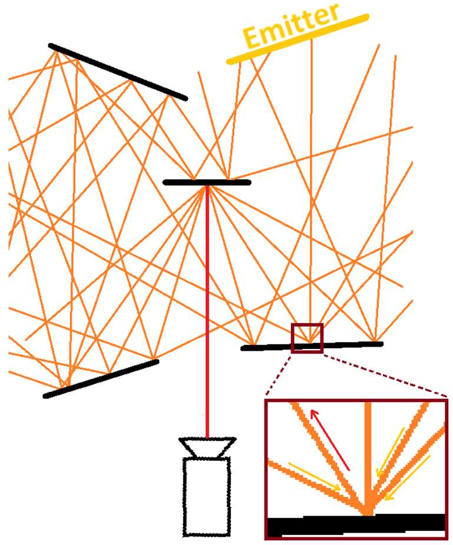

광선의 반사가 일어날 때마다 모든 표면 위의 모든 점에 대한 적분을 고려해야 하므로, 렌더링 방정식은 일반적으로 분석적인 해를 구하기 어렵습니다. 따라서 실제 렌더링에서는 몬테카를로 추정을 통해 이 적분을 근사하는 방법을 사용합니다.

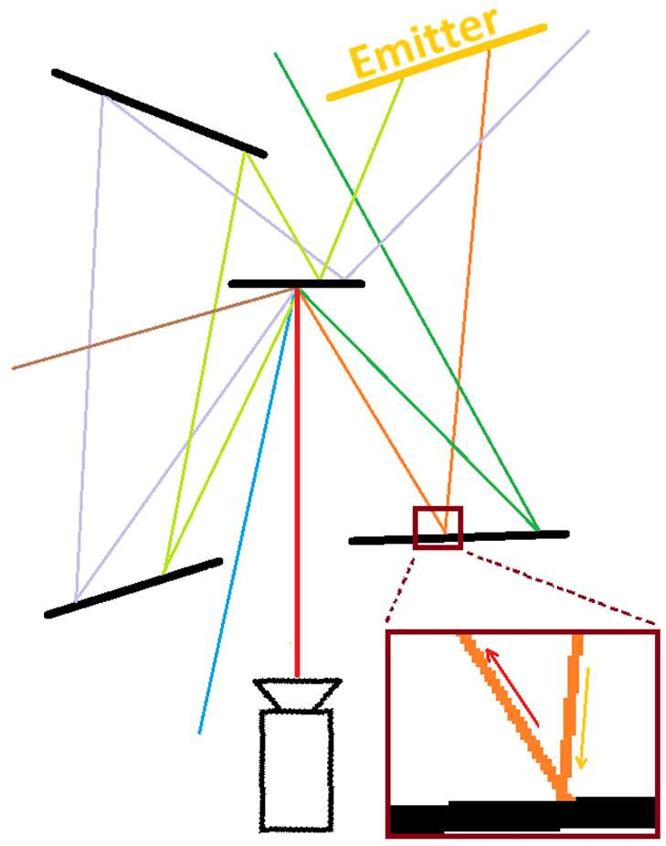

## 1.3 몬테카를로 적분과 경로 추적

몬테카를로 방법은 무작위 샘플링을 통해 적분을 근사하는 기법입니다. 물리 기반 렌더링에서는 경로 추적(Path Tracing)이 대표적으로 사용됩니다.

경로(path)는 카메라에서 출발한 광선(ray)이 표면과 만나고, 그 지점에서 다른 방향으로 반사되거나 산란되는 과정을 반복하여 광원에 도달하거나 종료될 때까지 이어지는 일련의 광선들입니다.

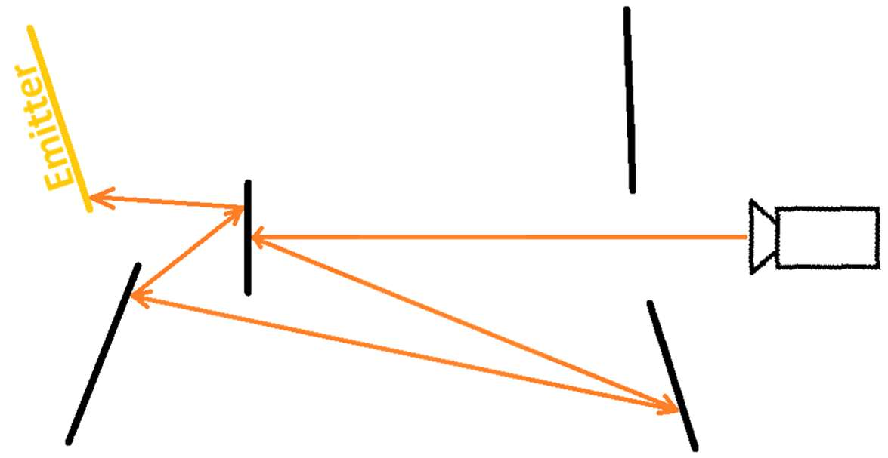

각 경로는 픽셀 값에 대한 하나의 샘플을 제공합니다. 많은 경로 샘플을 평균하면 렌더링 방정식의 해에 가까운 값을 얻을 수 있습니다.

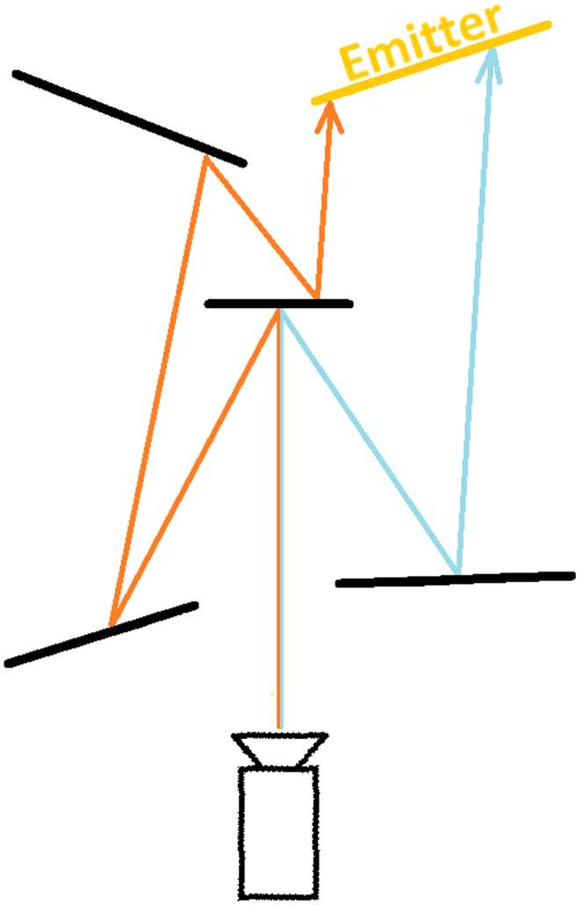

효율적인 샘플링을 위해서는 단순한 균일(Uniform) 샘플링보다 중요도 샘플링(Importance Sampling)을 사용합니다. 여기서 BSDF(Bidirectional Scattering Distribution Function)는 어떤 방향으로 빛이 더 많이 분포하는지를 나타내므로, 샘플링 분포를 설계할 때 중요한 역할을 합니다.

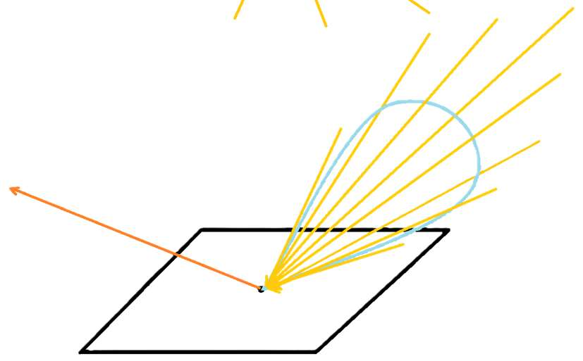

경로 추적의 단점은 샘플 수와 화질 사이의 트레이드오프입니다. 샘플 수가 적으면 이미지에 noise가 남고, 샘플 수를 늘리면 연산 비용이 증가합니다.

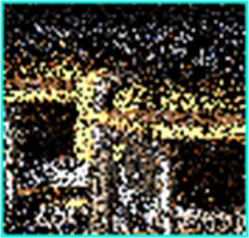

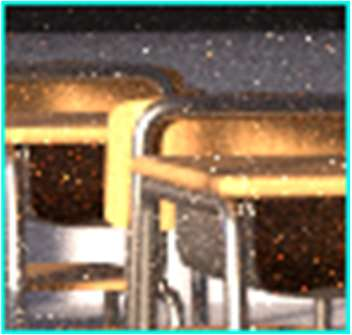

Noise는 이미지 내에서 원치 않는 색상 또는 강도의 무작위 변화를 의미합니다.

# 2 잡음제거

## 2.1 배경

경로 추적법의 연산량은 SPP(samples per pixel)에 거의 비례합니다. 빠른 렌더링이 필요할 때는 연산량을 줄이기 위해 낮은 SPP를 사용합니다. 그러나 샘플 수가 적으면 각 픽셀의 radiance 추정값이 충분히 평균되지 못하므로 noise가 이미지에 그대로 드러납니다.

각 path sample은 실제 기대값 주변에서 무작위로 흔들리는 추정값입니다. 어떤 경로는 광원에 도달하지 못해 검은 값을 반환할 수 있고, 어떤 경로는 드물게 매우 밝은 값을 반환할 수 있습니다. 충분히 많은 샘플을 평균하면 이러한 변동이 줄어들지만, low SPP에서는 이 변동이 픽셀 단위의 잡음으로 나타납니다.

따라서 빠르게 깨끗한 이미지를 얻기 위해서는 저샘플 이미지를 사용하되, 후처리 단계에서 잡음을 제거합니다. 이것이 Monte Carlo rendering denoising의 기본 목적입니다.

## 2.2 원리

잡음제거의 기본 아이디어는 주변 픽셀 $\Omega(p)$을 가중 평균하는 것입니다.

$$
\widehat{C(p)} = \frac{1}{k} \sum_{q \in \Omega(p)} w(p, q)C(q)
$$

$$
k = \sum_{q \in \Omega(p)} w(p, q)
$$

이 연산은 필터링합니다. 주변 픽셀을 단순히 모두 섞으면 blur가 생기므로, 어떤 픽셀을 얼마나 섞을지 결정하는 가중치 $w(p,q)$를 잘 설계하는 것이 핵심입니다.

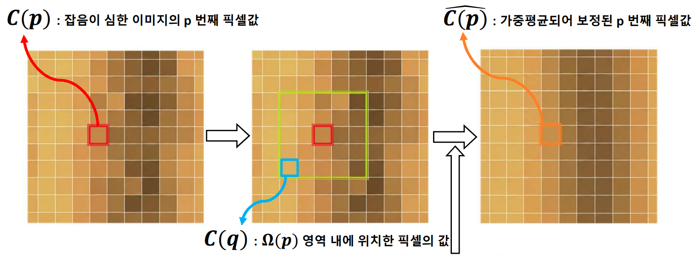

목표는 경계와 같은 디테일을 유지하면서 잡음을 제거하는 것입니다. 같은 표면에 속한 픽셀끼리는 큰 가중치를 주고, 깊이, 재질, 법선 등이 크게 다른 픽셀은 작은 가중치를 줍니다. 또한 잡음이 심할수록 더 강하게 필터링합니다.

이때 depth, normal, albedo와 같은 보조 버퍼를 참고합니다. 보조 버퍼는 렌더링 과정에서 비교적 쉽게 얻을 수 있고, color image보다 noise가 적기 때문에 어떤 픽셀들이 같은 표면 또는 같은 구조에 속하는지 판단하는 데 도움을 줍니다.

## 2.3 고전적인 잡음제거

대표적인 고전적 방법 중 하나는 Edge-Avoiding A-Trous Filtering입니다.

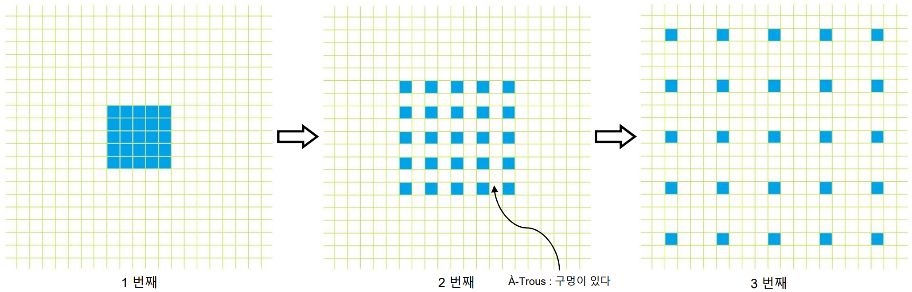

이 방법은 여러 번 반복 필터링합니다. 첫 번째 단계에서는 주변 $5\times5$ 픽셀을 사용합니다. 다음 단계에서는 더 넓은 $9\times9$ 영역을 참고하지만, 픽셀 간 간격을 두어 실제로는 25개 픽셀만 사용합니다. 그 다음 단계에서는 $17\times17$처럼 더 넓은 영역을 참고하면서도 같은 방식으로 sparse한 25개 픽셀을 사용합니다.

이처럼 filter support를 점점 넓히면 넓은 영역의 noise를 줄일 수 있습니다. 동시에 모든 픽셀을 조밀하게 사용하지 않기 때문에 계산량을 제한합니다.

이때 사용되는 가중치는 법선과 위치 정보에 기반한 edge-stopping function입니다.

$$
w(p,q)=w_{rt}w_nw_x
$$

Edge-stopping function은 물체 경계나 재질 경계를 넘어서 픽셀들이 섞이지 않도록 weight를 작게 만드는 함수입니다. 같은 표면일 경우에는 강하게 필터링하고, 다른 표면일 경우에는 약하게 필터링합니다.

보조 버퍼에는 알베도, 법선 벡터, 깊이값 등이 있습니다. 이 예시에서는 법선 벡터 $w_n$과 3차원 위치 버퍼 $w_x$를 사용합니다. $w_{rt}$는 렌더링된 이미지에서 얻은 radiance/color 기반 가중치로 볼 수 있습니다. 이러한 보조 정보를 사용하면 경계와 같은 디테일을 유지하면서 잡음을 줄일 수 있습니다.

## 2.4 딥러닝 기반 잡음제거

딥러닝 기반 잡음제거에서는 신경망이 필터링 가중치 $w(p,q)$를 적응적으로 조절합니다. 입력으로 noisy rendered image만 사용하는 것이 아니라, normal, albedo, depth 같은 보조 버퍼도 함께 제공합니다. 네트워크는 이 정보를 이용해 어떤 영역은 평균하고, 어떤 경계는 보존해야 하는지 학습합니다.

예를 들어 Intel Open Image Denoise(OIDN)는 렌더링 결과와 보조 버퍼를 함께 사용해 Monte Carlo noise를 줄이는 대표적인 딥러닝 기반 denoiser입니다.

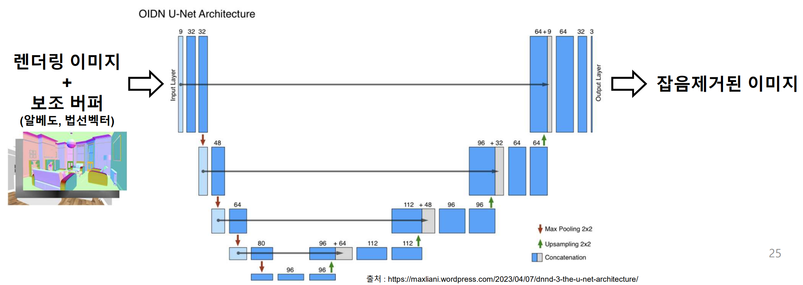

# 3 JSA
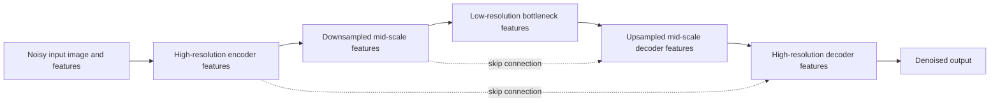
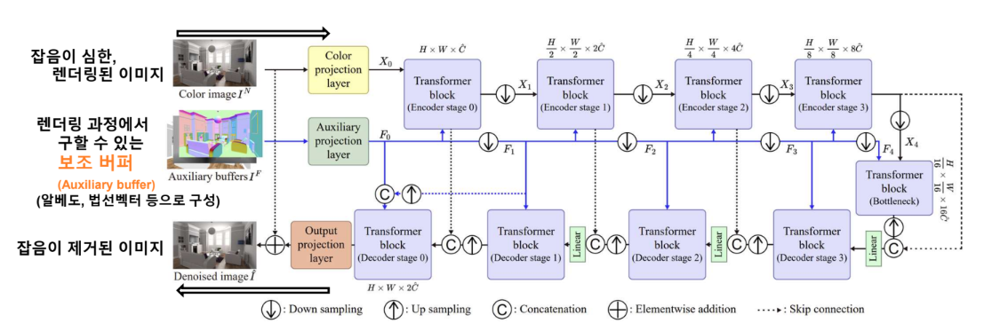
JSA 구조는 U-net구조를 채택하고 있는 트랜스포머 기반 네트워크입니다. U-net구조는 이미지의 해상도가 고해상도 $\to$ 저해상도 $\to$ 고해상도를 복원되는 구조이고 이와 같은 형태로 인해 U-net이라고 불리게 되었습니다. 그리고 encoder-decoder 구조에 skip connection을 결합한 multi-scale feature extraction 구조입니다.

Denoising에서 이 multi-scale 구조가 중요한 이유는 noise와 signal이 서로 다른 scale에서 나타나기 때문입니다. Monte Carlo noise는 pixel 단위로 랜덤하게 튀는 고주파 성분처럼 보이는 경우가 많지만, 실제 장면의 구조는 normal, depth, object boundary, indirect illumination처럼 local detail과 global context를 동시에 가집니다. 고해상도 feature만 사용하면 edge나 texture detail은 잘 볼 수 있지만 넓은 영역의 조명 패턴이나 표면의 연속성을 판단하기 어렵고, 저해상도 feature만 사용하면 큰 구조는 볼 수 있지만 얇은 경계나 세부 texture가 blur될 수 있습니다.

U-Net은 이 두 문제를 encoder와 decoder의 역할 분리로 완화합니다. Encoder는 downsampling을 통해 noise가 섞인 입력을 더 추상적인 feature로 바꾸고, 저해상도 단계에서는 넓은 영역의 similarity와 구조를 파악합니다. Decoder는 이 압축된 feature를 다시 고해상도로 복원하면서 denoised image를 생성합니다. 이때 skip connection은 encoder의 고해상도 feature를 decoder로 직접 전달하므로, downsampling 과정에서 사라지기 쉬운 edge, thin structure, texture 정보를 복원 단계에서 다시 사용할 수 있게 합니다.

U-net의 큰 이점으로는 해상도가  고해상도 $\to$ 저해상도 $\to$ 고해상도로 바뀌는 구조이기 때문에 기존 고해상도 $\to$ 고해상도를 지속하는 네트워크 대비 연산량이 줄어든다는 이점이 있습니다. 이에 따라, 기존 트랜스포머 기반 잡음 제거 모델인 AFGSA 대비 JSA가 빠른 속도를 보여준다는 것을 볼 수 있습니다.

## 3.1 Joint Self Attention
$$
\begin{align}
 \hat{X}&=\text{Attention}(Q_{X},K_{X},V_{X}) \\
 & = softmax(S_{X})V_{X} \\
 & = softmax\left( \frac{Q_{X}K^T_{X}}{\sqrt{ d }} \right)V_{X}
\end{align}
$$
기존에 트랜스포머 구조에서 추가적인 입력을 사용할 때 자주 쓰는 Cross-Attention과 달리, JSA 논문에서는 Joint-Self-Attention 구조를 제안합니다.[^2] 기존 Cross-Attention은 보통 query는 현재 feature에서 만들고, key와 value는 conditioning feature에서 만듭니다. 즉, 현재 feature가 추가 입력의 어떤 token을 참고해야 하는지를 attention으로 정하고, 그 결과로 추가 입력의 value 정보를 현재 feature에 주입하는 구조입니다. 

트랜스포머 네트워크 구조에서 출력물을 생성하는데 있어서, value값이 가지는 기여가 큽니다. 따라서, Monte Carlo denoising에서는 이 방식이 항상 이상적이지 않습니다. Denoising의 핵심 output은 noisy color image가 가진 radiance/shading 정보를 깨끗하게 복원하는 것입니다. G-buffer는 normal, depth, albedo처럼 noise가 적고 기하학적 경계가 뚜렷한 정보를 제공하지만, 직접적인 shading이나 indirect illumination의 완전한 정보를 갖고 있지는 않습니다. 따라서 G-buffer를 value처럼 강하게 주입하면, 네트워크가 색의 noise를 줄이는 데 도움을 받을 수는 있지만 최종적으로 복원해야 하는 color signal 자체를 G-buffer feature 쪽으로 지나치게 끌고 갈 위험이 있습니다.

JSA의 관점은 조금 다릅니다. G-buffer를 "복사해서 넣을 정보"라기보다 "어떤 pixel끼리 섞어도 안전한지 판단하는 기준"으로 사용합니다. 일반적인 self-attention에서 $S_X$는 color feature $X$만 보고 token 간 similarity를 계산합니다.

$$
\begin{align}
S_X &= \frac{Q_XK_X^T}{\sqrt{d}} \\
\hat{X} &= softmax(S_X)V_X
\end{align}
$$

여기서 각 output token $\hat{x}_i$는 주변 token들의 value $v_j$를 attention weight로 가중합한 값입니다. Denoising 관점에서는 이 연산이 adaptive filtering처럼 동작합니다. 서로 비슷하다고 판단된 pixel들의 radiance를 모아 평균내면 독립적인 Monte Carlo noise는 줄어들고, edge나 texture처럼 서로 다르다고 판단된 pixel들은 낮은 weight를 받아 섞이지 않습니다.

문제는 color feature $X$ 자체가 noisy하다는 점입니다. Noise가 심하면 실제로 같은 표면에 있는 pixel들이 다르게 보일 수 있고, 반대로 서로 다른 표면의 pixel들이 우연히 비슷한 noisy color를 가질 수도 있습니다. 이 경우 $S_X$만으로 만든 attention map은 불안정해지고, 경계 주변에서 blur나 color bleeding이 발생할 수 있습니다.

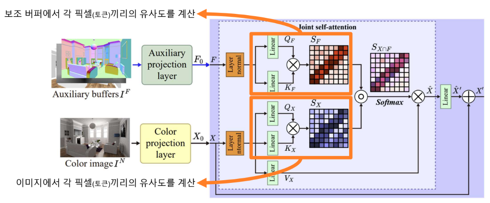
JSA는 이를 보완하기 위해 auxiliary feature $F$에서도 별도의 self-attention score를 만듭니다. $F$는 G-buffer에서 projection된 feature로 볼 수 있으며, color보다 noise가 적고 normal/depth/albedo의 discontinuity를 잘 보존합니다.

$$
\begin{align}
S_X &= \frac{Q_XK_X^T}{\sqrt{d}} \\
S_F &= \frac{Q_FK_F^T}{\sqrt{d}} \\
S_{X \cap F} &= S_X \circ S_F \\
\hat{X} &= softmax(S_{X \cap F})V_X
\end{align}
$$

여기서 ($\circ$)는 element-wise product입니다. 이 곱셈은 두 attention score의 교집합을 만드는 역할을 합니다. 어떤 두 pixel이 color feature 기준으로 비슷하더라도, normal이나 depth가 크게 다르면 $S_F$가 낮아져 최종 attention에서 억제됩니다. 반대로 G-buffer 기준으로 같은 표면처럼 보여도 color/shading feature가 다르면 $S_X$가 낮아져 무작정 평균되지 않습니다. 결과적으로 JSA는 "color에서도 비슷하고, geometry/material에서도 비슷한 token"에 높은 weight를 주는 방식으로 denoising filter를 학습합니다.

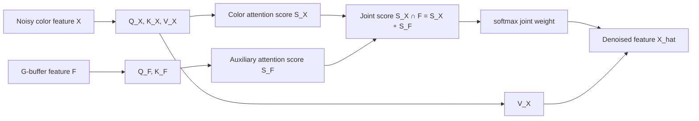

중요한 점은 최종 value로는 $V_X$를 사용한다는 것입니다. 즉, JSA는 G-buffer feature를 직접 output으로 평균하는 것이 아니라, noisy color feature를 어떻게 평균할지 결정하는 attention weight에 G-buffer를 반영합니다.[^3] 이 때문에 color image가 가진 shading 정보는 유지하면서도, G-buffer가 제공하는 안정적인 구조 정보를 통해 잘못된 noise pixel이 섞이는 것을 줄일 수 있습니다.

이 구조가 denoising에 도움이 되는 이유는 transformer의 attention 연산이 단순한 feature transform이 아니라, 학습된 non-local weighted average로 해석될 수 있기 때문입니다. Monte Carlo noise는 sample 수가 적어서 pixel별 radiance 추정값에 랜덤한 오차가 섞인 상태입니다. Attention은 한 pixel을 복원할 때 같은 window 안의 다른 pixel들을 참조하고, JSA는 그 참조 대상을 color similarity와 G-buffer similarity로 동시에 제한합니다. 따라서 같은 표면 위에서는 여러 noisy estimate를 모아 variance를 줄이고, 표면 경계나 얇은 구조에서는 서로 다른 영역의 radiance가 섞이는 것을 막아 detail을 보존합니다.

정리하면, Cross-Attention이 "추가 입력의 정보를 현재 feature에 주입"하는 방식에 가깝다면, JSA는 "현재 color feature를 복원하되, G-buffer를 이용해 attention weight를 더 신뢰성 있게 제한"하는 방식입니다. 그래서 JSA의 transformer 연산은 Monte Carlo image denoising에서 필요한 두 조건, 즉 noise reduction과 detail preservation을 동시에 만족시키는 쪽으로 동작합니다.

## 3.2 Convolution Network
해당 버전은 JSA 전체 구조를 convolutional network로 바꾼 것이 아니라, Decoder의 마지막 복원 부분만 SwinIR 구조를 참고하여 convolution 기반 구조로 수정하였습니다.[^4] 기존 JSA의 핵심인 Joint Self-Attention block은 유지하되, 최종적으로 고해상도 denoised image를 생성하는 decoder 말단부에서 transformer 연산 대신 convolution 연산을 사용하도록 바꾼 것입니다.

JSA 기준, Multi-Head Self attention(MSA)과 Window based Multi-Head Self attention(W-MSA)의 시간복잡도는 아래와 같습니다.
$$
\begin{align}
&	\Omega_{MSA} = 6hwC^2 + 2(hw)^2C \\
& \Omega_{W-MSA} = 6hwC^2 + 2M^2(hw)C
\end{align}
$$
이때 $M$은 window의 크기를 의미하는 것이라 상수배입니다. 따라서, 최종적인 시간복잡도는 두 항의 결합이며, 이 두 항은 각각 병렬로 진행되지 못하고 순차적으로 진행되는 특징이 있습니다. 

$$
\begin{align}
	\Omega_{Conv} = 9hwC^2
\end{align}
$$
현재 네트워크는 3x3 convolutional network를 사용하였습니다. 3x3 Convolution 연산이 위와 같은 시간복잡도를 가지지만, 트랜스포머 구조보다 빠른 이유는 아래와 같습니다.

Convolution Network의 경우에는 고정적인 크기의 Convolutional Filter를  가집니다. 또한, 트랜스포머 기반 모델의 경우 여러 연산기법을 순차적으로 적용해야하는 반면, Convolution 연산의 경우 GPU병렬로 한번에 처리되기에 하드웨어 친화적 접근이 가능합니다. 이러한 이유를 기반으로 하여, Convolution 연산을 채택하였습니다.

다만, 기존 연구인 SwinIR에서는 G-Buffer(albedo, normal and depth)와 같은 정보 없이, 이미지 단계에서 연구를 진행하였습니다. 따라서, G-Buffer의 정보를 극대화하기 위해서 두 가지를 구조를 채택하였습니다.

1. 기존 JSA구조와 동일하게 \[latent feature, g-buffer feature\]를 concatenation하여, 네트워크의 입력으로써 전달하였습니다. 
2. 레이어가 깊어짐에 따라, 기존 G-Buffer정보가 희미해져 손실이 발생하는 문제를 해결하기 위해 FiLM기반 구조를 통해 각 네트워크 층마다 G-Buffer 정보를 주입하여 나무와 나뭇잎과 같이 기하학적으로 복잡한 지형에서 과하게 Blur처리되는 문제를 완화시켰습니다.[^5]

# 4 Bicubic

Bicubic interpolation은 이미지를 확대하거나 feature map의 해상도를 올릴 때 사용하는 고정적인 보간 방법입니다. 여기서 중요한 점은 bicubic은 neural network처럼 학습되는 layer가 아니라, 주변 pixel 값을 정해진 수식으로 섞어서 새로운 위치의 값을 계산하는 deterministic image resizing method라는 것입니다.

가장 단순한 upsampling 방법인 nearest neighbor는 새 pixel 위치에서 가장 가까운 원본 pixel 하나만 가져옵니다. 이 방식은 빠르지만 계단 현상이나 blocky artifact가 쉽게 생깁니다. Bilinear interpolation은 주변 $2 \times 2$ pixel을 사용해서 x축과 y축 방향으로 선형 보간을 수행합니다. Bicubic interpolation은 여기서 더 나아가 주변 $4 \times 4$ pixel, 즉 총 16개의 pixel을 사용하고, 선형 함수 대신 cubic kernel을 사용합니다.

직관적으로 bicubic은 새 pixel 값을 만들 때 바로 옆 pixel만 보는 것이 아니라 조금 더 넓은 주변의 변화율까지 고려합니다. 그래서 bilinear보다 경계와 gradient가 더 부드럽게 이어지는 결과를 만들 수 있습니다. 이미지 확대에서 bicubic 결과가 bilinear보다 덜 단순하고, nearest neighbor보다 훨씬 자연스럽게 보이는 이유가 여기에 있습니다.

1D cubic interpolation을 먼저 생각하면, 새로운 위치 $x$의 값은 주변 네 개의 sample을 cubic weight로 가중합하여 계산됩니다.

$$
f(x) = \sum_{i=-1}^{2} w_i(x) f_i
$$

2D image에서는 이 과정을 x축과 y축에 대해 separable하게 적용합니다. 즉, 먼저 x방향으로 네 개의 값을 cubic interpolation하고, 그 결과를 다시 y방향으로 cubic interpolation합니다. 이를 한 번에 쓰면 다음과 같이 볼 수 있습니다.

$$
I(x,y) = \sum_{m=-1}^{2}\sum_{n=-1}^{2} I(i+m,j+n)k(x-m)k(y-n)
$$

여기서 $I(i+m,j+n)$는 주변 $4 \times 4$ pixel 값이고, $k(\cdot)$는 pixel 사이 거리로부터 계산되는 cubic kernel입니다. 가까운 pixel일수록 더 큰 weight를 받고, 멀리 있는 pixel은 더 작은 weight를 받습니다. 다만 cubic kernel은 단순히 양수 weight만 쓰는 것이 아니라 일부 구간에서 음수 weight가 생길 수 있기 때문에, edge 근처에서 약한 ringing artifact가 생길 수도 있습니다.

Bicubic에서 자주 사용하는 kernel은 Keys cubic convolution kernel 형태로 쓸 수 있습니다. 거리 $t$에 대해 $r=|t|$라고 두면, kernel은 다음과 같이 piece-wise cubic polynomial로 정의됩니다.

$$
k(t)=
\begin{cases}
(a+2)r^3-(a+3)r^2+1, & 0 \le r < 1 \\
ar^3-5ar^2+8ar-4a, & 1 \le r < 2 \\
0, & 2 \le r
\end{cases}
$$

이 식에서 $a$는 kernel의 sharpness를 조절하는 파라미터입니다. 보통 $a=-0.5$를 사용하면 비교적 선명한 보간 결과를 만들고, 일부 image processing library에서는 $a=-0.75$처럼 조금 다른 값을 사용하기도 합니다. $a$가 음수이기 때문에 $1 \le r < 2$ 구간의 weight 일부가 음수가 될 수 있고, 이 음수 weight가 edge를 더 선명하게 만드는 데 도움을 주는 동시에 ringing artifact의 원인이 될 수 있습니다.

Kernel의 support는 $r<2$입니다. 즉, 한 방향에서 target position으로부터 거리 2 이상 떨어진 pixel은 weight가 0이므로 계산에 참여하지 않습니다. 그래서 x축에서 4개, y축에서 4개의 sample만 사용하게 되고, 최종 2D weight는 두 1D kernel의 곱으로 구성됩니다.

$$
w_{m,n}=k(x-m)k(y-n)
$$

따라서 bicubic interpolation은 새로운 pixel 하나를 만들 때 16개 주변 pixel을 각각 $w_{m,n}$으로 가중합하는 구조입니다. 이 구조는 separable kernel이기 때문에 2D cubic surface를 직접 계산하는 것보다 효율적으로 구현할 수 있습니다.

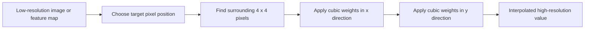

bicubic이 denoising 자체를 수행하는 모듈은 아닙니다. Bicubic은 noise를 학습적으로 제거하지 않고, 단지 낮은 해상도의 image 또는 feature를 높은 해상도로 부드럽게 늘립니다.

정리하면, bicubic은 주변 $4 \times 4$ pixel의 값을 cubic kernel로 섞어 고해상도 값을 만드는 보간법입니다. 장점은 구현이 단순하고 안정적이며 부드러운 upsampling을 제공한다는 점입니다. 단점은 학습이 없기 때문에 장면 구조, normal/depth discontinuity, Monte Carlo noise의 통계적 특성을 반영하지 못한다는 점입니다.

[^1]: James T. Kajiya. 1986. The rendering equation. SIGGRAPH Comput. Graph. 20, 4 (Aug. 1986), 143–150. https://doi.org/10.1145/15886.15902
[^2]: Joint Self-Attention for Denoising Monte Carlo Rendering project page, https://cglab.gist.ac.kr/visualcomputer24jsa/.
[^3]: Official code repository: CGLab-GIST/joint-self-attetion, https://github.com/CGLab-GIST/joint-self-attetion
[^4]: SwinIR: Image Restoration Using Swin Transformer(2021), https://arxiv.org/abs/2108.10257
[^5]: FiLM: Visual Reasoning with a General Conditioning Layer(2017), https://arxiv.org/abs/1709.07871
