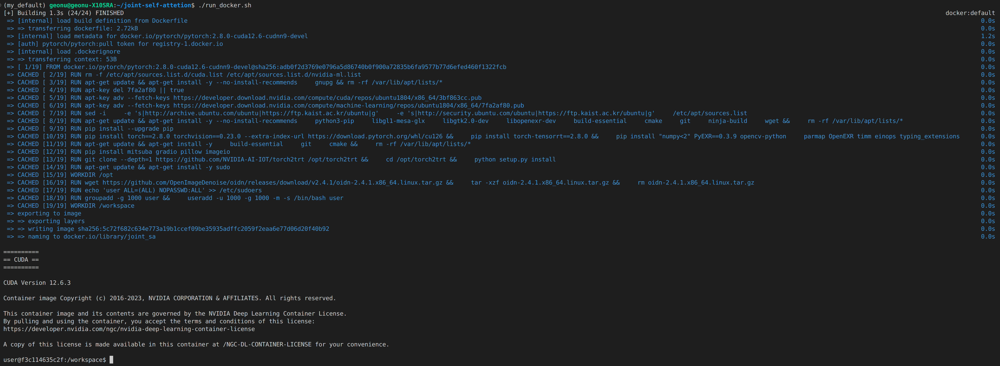
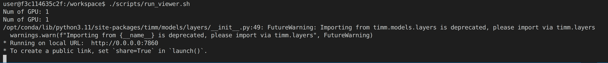
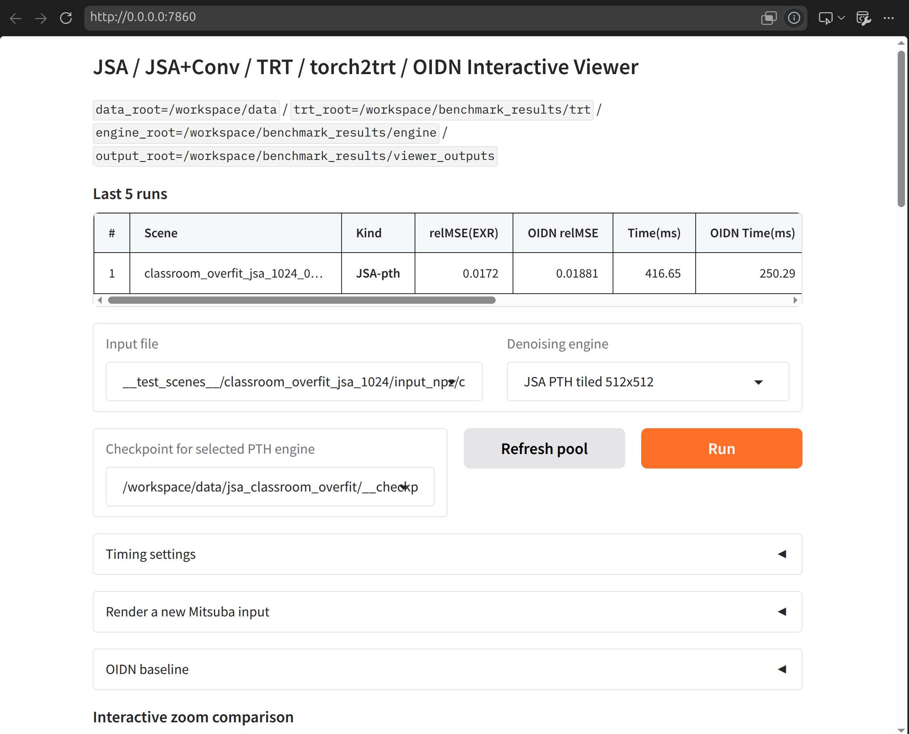

# Assuming we have all the dependencies and trained pth

1. run docker (if required)

2. You can run localhost URL via just running ./scripts/run_viewer.sh

    - you can access to the viewer through local URL (http://0.0.0.0:7860 or http://localhost:7860 for this case) 
    

3. To create a temporary public Gradio link with authentication, run:

```bash
GRADIO_SHARE=1 \
GRADIO_AUTH_USER=userName \
GRADIO_AUTH_PASS='your_password' \
./scripts/run_viewer.sh
```
It will then print a public URL, such as `https://xxxxxxxx.gradio.live`, which you can share with others. Anyone with the link and the login credentials can access and test the viewer, while inference runs on the host machine using its GPU.